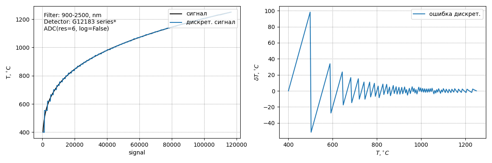
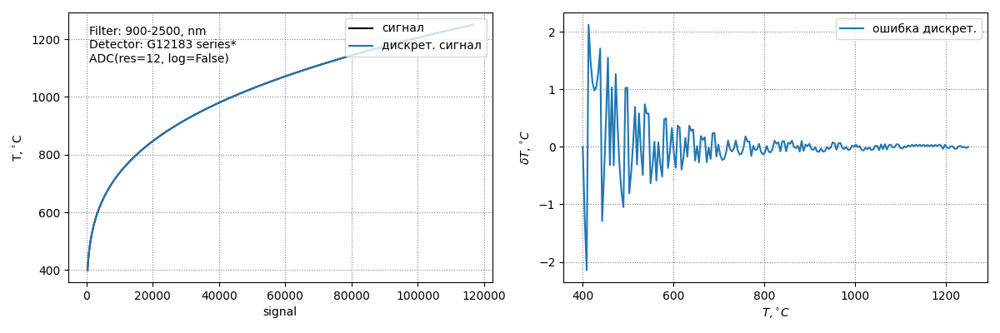

# Optical Pyrometer

## Излучение черного тела

Для абсолютно чёрного тела **спектральную плотность излучения** на единицу площади ($W/m^{3}$) можно рассчитать по формуле:
$$I_{\lambda} = \frac{2 \pi h c^{2}}{\lambda^{5}}\frac{1}{e^{hc / \lambda k T} - 1},$$
где $T$ - температура ($^{\circ}K$), $h$ - постоянная Планка ($J \cdot c$), $k$ - постоянная Больцмана ($J / K$), $c$ - скорость света ($m/c$).

    <figure>
        
        <figcaption>Рис. 1. Спектральная плотность излучения в зависимости длины волны при разной температуре</figcaption>
    </figure>

Тогда **излучение** на единицу площади ($W/m^{2}$) можно определить по формуле:
$$I = \int_{\lambda_{min}}^{\lambda_{max}}{I_{\lambda} \cdot d\lambda},$$
где $[\lambda_{min}; \lambda_{max}]$ - диапазон чувствительности детектора.

## Параметры системы измерения
Пусть требуется измерить температуру объекта в диапазоне $T \in [T_{1}, T_{2}]$.

### Детектор
***Спектральная чувствительность детектора***

    <figure>
        
        <figcaption>Рис. 2. Спектральная плотность излучения в зависимости длины волны при разной температуре (черным) и сигнал с учетом спектральной чувствительности и пропускания защитного стекла детектора Hamamatsu G12183 (синим)</figcaption>
    </figure>

### АЦП
***Разрешение АЦП***

Разрешение АЦП определяет шаг дискретизации измеренного **излучения**:
$$\Delta{I} = \frac{I_{2} - I_{1}}{2^{n} - 1},$$
где $n$ - разрешение АЦП, $I_{1}$ и $I_{2}$ излучение объекта при температуре $T_{1}$ и $T_{2}$ соответственно.

При этом, если требуется погрешность измерения температуры не более $10^{\circ}C$, то шаг дискретизации $\Delta{I}$ должен быть меньше, чем изменение излучения при изменение температуры на $10^{\circ}C$:
$$\Delta{I} < I_{T_{1} + 10} - I_{T_{1}}.$$

    <figure>
        
        <figcaption>Рис. 3. Зависимость температуры от выходного сигнала фотодиода (черным) и после 6-bit АЦП (синим) представлена слева и погрешность измереной температуры справа
        </figcaption>
    </figure>

    <figure>
        
        <figcaption>Рис. 4. Зависимость температуры от выходного сигнала фотодиода (черным) и после 12-bit АЦП (синим) представлена слева и погрешность измереной температуры справа
        </figcaption>
    </figure>

